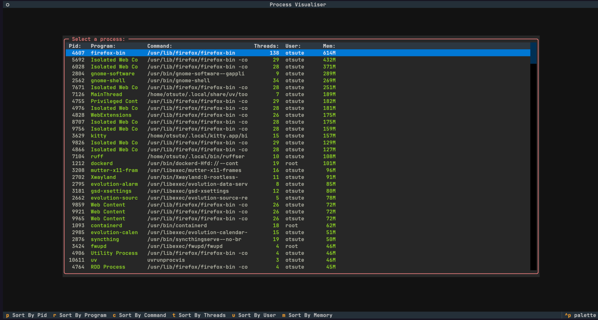
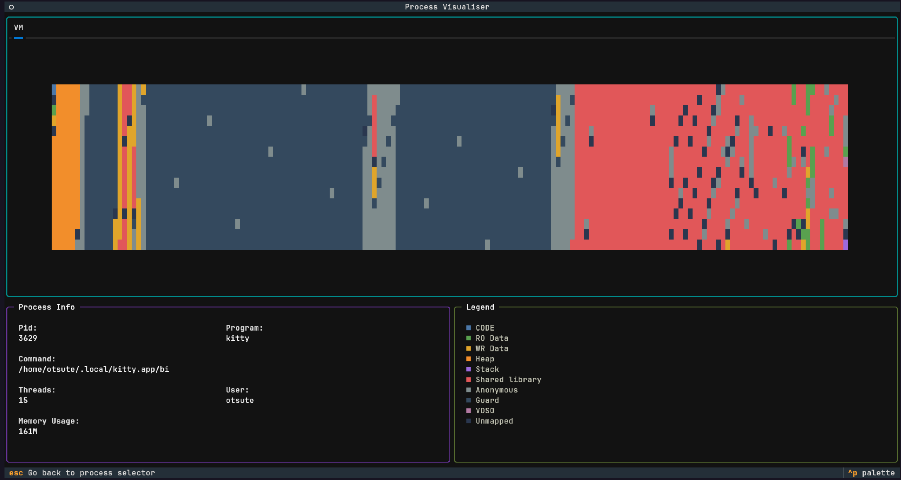

# Procvis

A terminal-based tool for visualising process memory built with Python and Textual.

## Requirements

- [uv](https://docs.astral.sh/uv/)
- make

## Running

Clone the repository:

```bash
git clone https://github.com/Otsutez/procvis.git
cd procvis
```

Build the C helper, note that it will ask for sudo permission as we have to give cap_sys_admin capability to the C executable, for more information see [Makefile](/Makefile).

```bash
make
```

Then run procvis:

```bash
uv run procvis
```

## Features

Procvis provides a btop-like process selector. You can sort the selector based on pid, program name, command line, number of threads, user name or memory usage.



Once you have selected a process, procvis shows different regions mapped inside the process virtual memory. Regions and there location are based on the process `/proc/pid/maps` file.



Please note that you can only view processes owned by you and not other processes owned by root.
